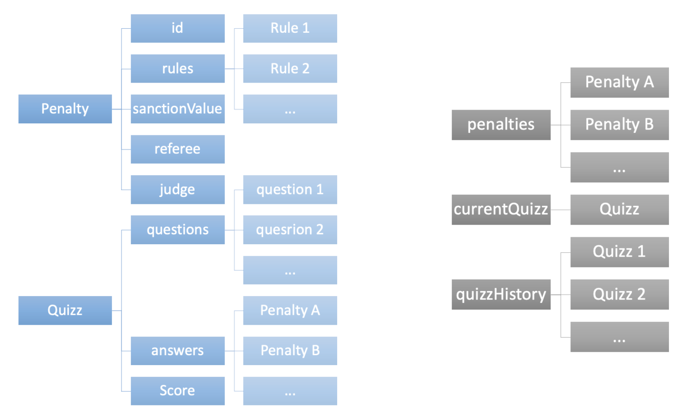

# Diving Rules

## Intro
The Diving Rules Application is a mobile hybrid app to train on the Fina Diving Rules. It is targeted for the diving judges and referees to learn the rule of the discipline and train on this knowledge.
This document is the Flutter App Readme.

## Technology
### Flutter Development
The Flutter version of the app is using dart coding and is transformed into Swift & Jetpack code.
The App is for the moment compatible with iOS vXX and Android vXX
[//] # (The app uses the SF Symbol Library for all this icons within the app.)

### Localization
The app has been localized in multiple languages. It is for the moment compatible with:
* EN (Default & Fallback)
* FR
* ES & Lat Am
* IT
  The [PO Editor](https://poeditor.com/projects/view?id=425927) tool is used to generate the various localizations Languages

## Version Control
The Project repository is hosted on GitHub:
* [Diving Rules](https://github.com/B3n-d1v3/diving_rules_hybrid/) holding the stable releases
* The work on this repo is performed in the [dev Branch](https://github.com/B3n-d1v3/diving_rules_hybrid/tree/dev)
* New Branches are created to create new features

## Scope of functionalities
The Diving Rules App is organized into the following tabs:

_[Open The Full Blueprint](/readme/DivingRulesFlow.pdf)_

* Rules: A view of the pdf file of the rules
* Penalties: a list of all the penalties summary that allow to view
    * the penalty description
    * the penalty sanction (there can be only one)
        * an award of 0 points
        * a maximum of 2 points
        * a maximum of 4 1/2 point
        * a deduction of 2 points to the judges grades by the referee
        * a deduction of 1/2 to 2 points by the judge
        * depending on the judges opinion
    * the penalty ownership (Referee and/or Judge)
* Quizz: where you can select the number of questions in your quizz and launch the quizz - for each question will show the same interface as the penalty list but will allow the user to:
    * select from one of the penalty sanctions (they are mutualy exclusive)
    * select within the penalty ownership (the selection can be Referee / Judge / or both)
    * When the user has at least selected a section and one owner then s/he can go to the next questions
* About: a description of the app and a disclamer of the fact that the app is not a fina app

## Data Model Structure
### Input Source Data (To be updated)
The code is structured around
* [divingPenaltiesSummary.json](https://github.com/B3n-d1v3/Diving-Rules-iOS/blob/main/Diving%20Rules/Ressources/divingPenaltiesSummary.json): a json to declare the penalties sanctions and ownerships
* [divingPenaltiesSanctions.json](https://github.com/B3n-d1v3/Diving-Rules-iOS/blob/main/Diving%20Rules/Ressources/divingPenaltiesSanctions.json): a json to list the sanctions descriptions (to check if still needed)
* The [localization files](https://github.com/B3n-d1v3/Diving-Rules-iOS/blob/main/Diving%20Rules/en.lproj/Localizable.strings) holding:
    * the app texts localization
    * the penalties description (the data presented in the app for a penalty is using the localization data and not the json description  - it is used in the description as a reference for the json creation and updates)

### Used Data model (To be updated)


#### The penalty mangement (To be updated)
* Penalty (refering v1.1): The information about one penalty
``` swift
    // penalty id number
    var id: Int
    // List of the rules associated with this penalty
    var rules: [Rule]
    // Rule is a table of strings to list the corresponding penalty reference
    
    // The sanction associated with this penalty
    var sanctionValue: Int
    // Is the referee concerned by this penalty
    var referee: Bool
    // Is the judge concerned by this penalty
    var judge: Bool
```
* Penalties (refering v1.1): The information about all the penalties
``` swift
    var penalties: [Penalty]
```


#### The Quizz Management (To be updated)

* Quizz (refering v1.1): The information about the quizz
``` swift
    // the list of the id's for the quizz
    var questions: [Int]
    // the list of answers provided to the questionnaire using the Penalty Model
    var answers: [Penalty]
    // score rewards
    var score: Int
``` 


* ButtonsStatus (refering v1.1): The information about the status of the button selections from the user in a question page
``` swift
    // penalty buttons status
    var penaltyZeroPts: Bool
    var penaltyMaxTwoPts: Bool
    var penaltyMaxFourHalfPts: Bool
    var penaltyMinusTwoPts: Bool
    var penaltyMinusHalfToTwoPts: Bool
    var penaltyJudgeOpinion: Bool
    
    // ownership buttons status
    var ownershipReferee: Bool
    var ownershipJudge: Bool
    
    // Other data needed
    // Sanction set by the user
    var userSanctionSelection: Int
    // has the user answered enough elemets to go to the next question
    var nextQuestion: Bool
```
* currentQuizz (ref v1.1): The object with the current Quizz Data Logged in
``` swift
    var currentQuizz: Quizz
```

* quizzHistory (ref v1.1): The object containing the table of quizz history of the user
``` swift
    var quizzHistory: [Quizz]
```

## Project Status
The app is in creation in this new flutter technology.

I would like to grow a comunity around this project to get new contributors to help on this open source project to update in the code.
It is possible to add new localization if we get a local language support.

New feature will be added

## Future Updates
These are the high level features to work on next:
- [ ] Add the pdf support to read the rule book
- [ ] Include the About page description
- [ ] Multilingual support
- [ ] View the list of the summary of penalties
- [ ] Add the Initial quizz support
- [ ] Add the ability to change the language at anytime within the app (user should always be able to switch from local language to EN)
- [ ] update the pdf to read an online version of the file and enclose the english as a fallback
- [ ] allow the user to view the history of his previous tests
- [ ] Add new Quizz not just based on the penalties list (Add multiple choice questions and true/false questions)
- [ ] Add a search functionality to search through the pdf and through the penalties

The full list can be found on the [Github Hybrid Kanban](https://github.com/users/B3n-d1v3/projects/2/views/1)

## Authors
This App was created by **[Benoit SUZANNE](mailto:BenDivingJudge@gmail.com?subject=FromGithubReadme)**


## Contributing
You are more then welcome to contribute to this project weather you're:
- a mobile developer
- a localization contributor who can help to add new languages
- a judge wanting to add new questions to to quizzes as they need to include more than just the penalty summaries

## License
This code was created under the [GNU 3.0 Open Source License](LICENSE). 
